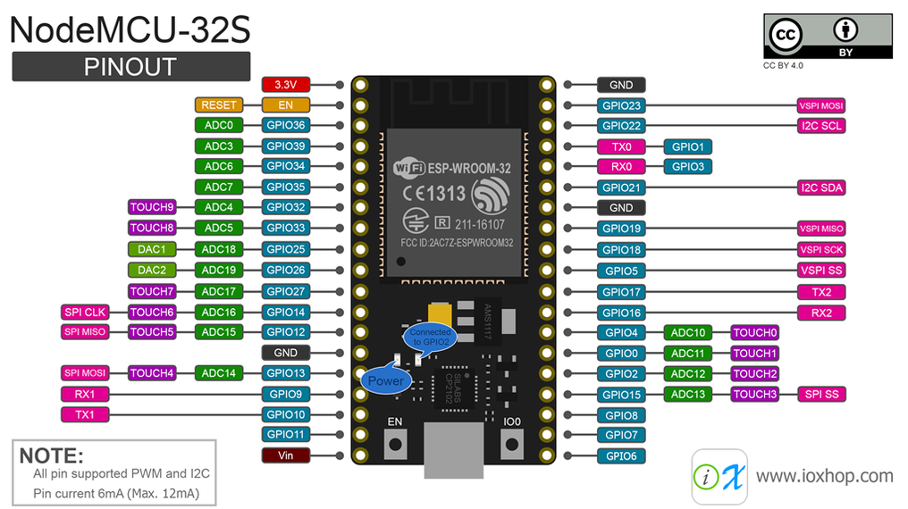

# FIRMWARE

## Dependencias

* Se necesita del entorno de desarrollo [Zephyr](https://docs.zephyrproject.org/latest/develop/getting_started/index.html).
* Se recomienda instalarlo de forma global y colocar en el archivo `~/.bash.rc` la instrucción `source /home/tu-usuario/zephyrproject/zephyr/zephyr-env.sh`
* Una placa *Nodemcu ESP32 Wroom* con su modo de *booteo* en [download](https://docs.espressif.com/projects/esptool/en/latest/esp32/advanced-topics/boot-mode-selection.html#manual-bootloader). En el caso de nuestra placa se debe presionar el botón de *boot* y mientras está pulsado se presiona el botón *EN*, luego se sueltan ambos.

En la siguiente imagen se puede observar la plataforma seleccionada:

El manual de referencia se encuentra en [esp32-reference-manual](docs/esp32_technical_reference_manual_en.pdf)

## Instrucciones

1. Clonar este repositorio
2. Ingresar dentro del proyecto
3. Ejecutar el comando `west build -b esp32 -p` para compilar el firmware
4. Asegurarse de tener la placa *Nodemcu ESP32 Wroom* conectada al ordenador.
5. Ejecutar el comando `west flash --esp-baud-rate 115200` para grabar el firmware en la placa

Se puede monitorear la secuencia de boot y mensajes del kernel con el siguiente comando:

`west espressif monitor -p /dev/ttyUSB0`

NOTA: el número de ttyUSB puede ser distinto de 0.
